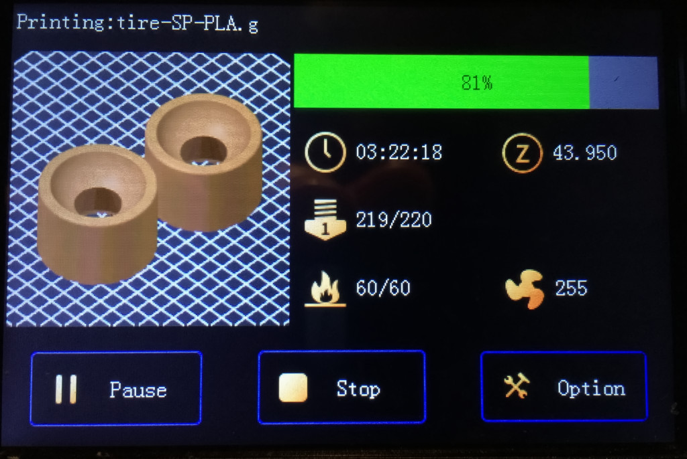
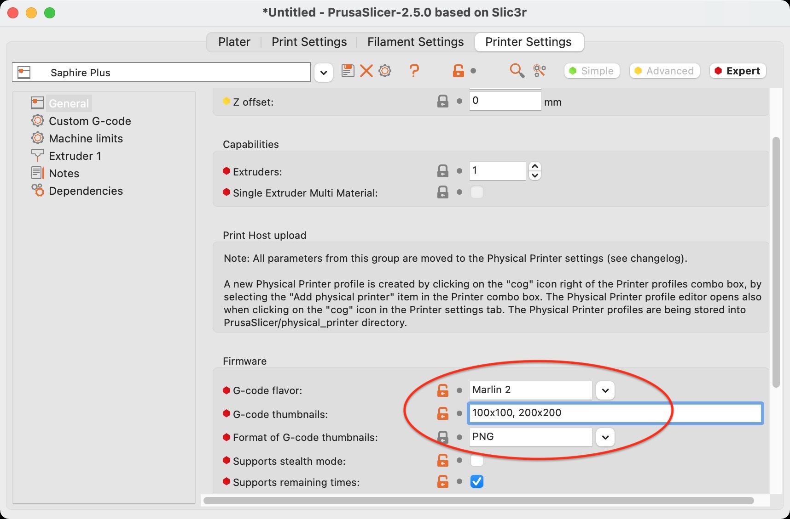
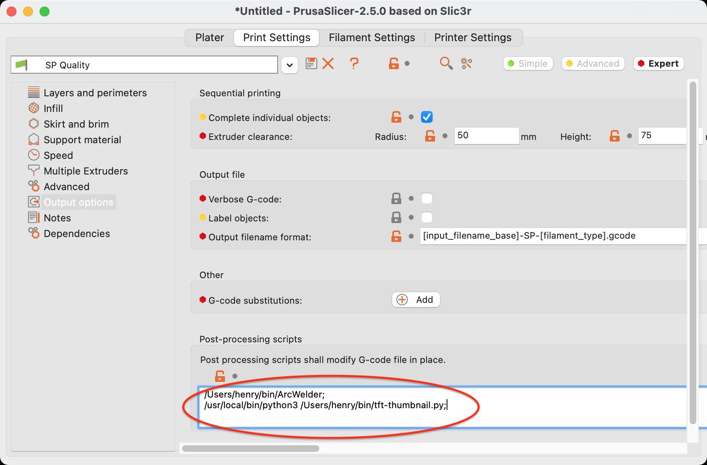

# TFT Thumbnail

**tft-thumbnail** is a Prusa Slicer post processor for Two Trees Sapphire Pro/Plus (and MKS Robin Nano TFT35) 3D printers for generating compatible preview images.

## Installation

Download the `tft-thumbnail.py` file and place it in your scripts folder. I use `~/bin` for this.

You will also need to make sure you have python3 installed and configured. On my Mac that can be done at the command prompt with:

`brew install python3`

Then I recommend you run this post processing script at the command prompt on a small G-code file to check that all the required python libraries are installed. For example:

`python3 tft-thumbnail.py test.gcode test-sp.gcode`

If you see any errors you can use `pip` to install any missing modules. For example:

`pip install regex`

`pip install Image`

## Prusa Slicer Setup

You need to configure Prusa Slicer to output preview images (G-code Thumbnails) and then run this post processing script to convert them into a format compatible with the MKS Robin Nano TFT35 display used by the Sapphire Pro/Plus 3D printers.

Under the **Printer Settings** tab, in **Firmware** settings:

* G-code flavor: **Marlin 2**
* G-code thumbnails: **100x100, 200x200**
* Format of G-code thumbnails: **PNG**

Under the **Print Settings** tab, in **Post-processing scripts** settings:

`/path/to/python3 /path/to/tft-thumbnail.py`
